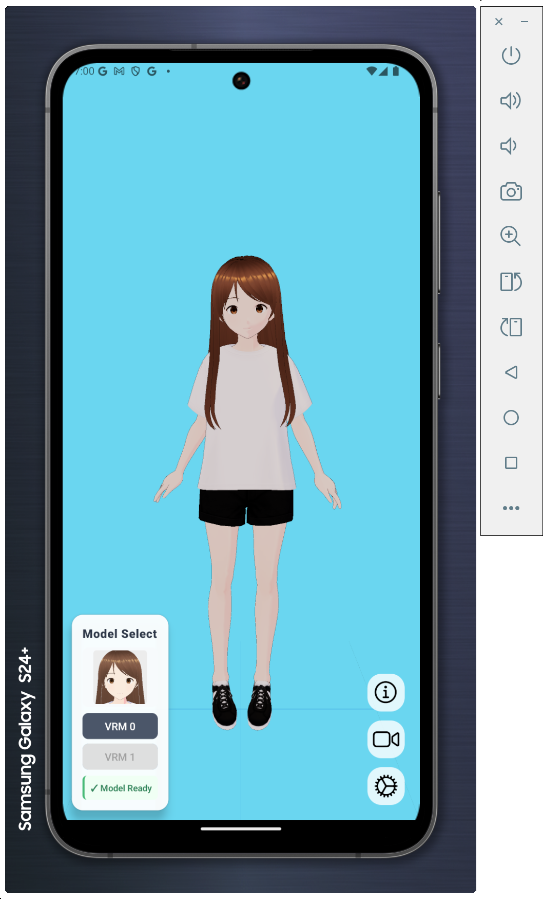
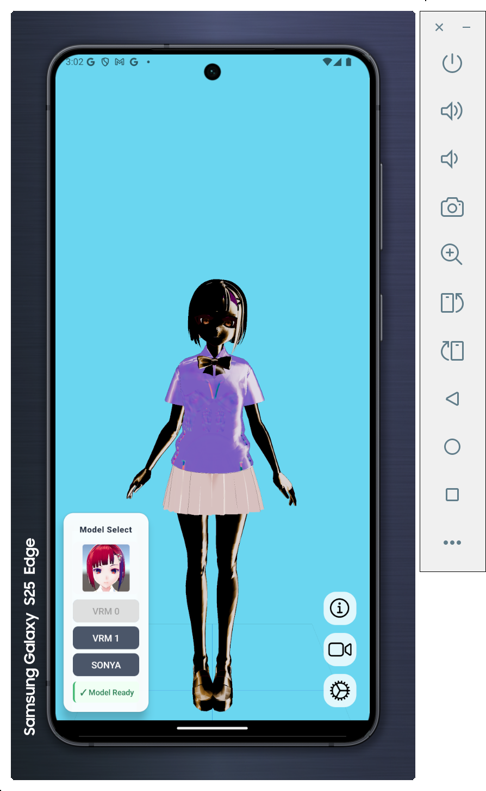
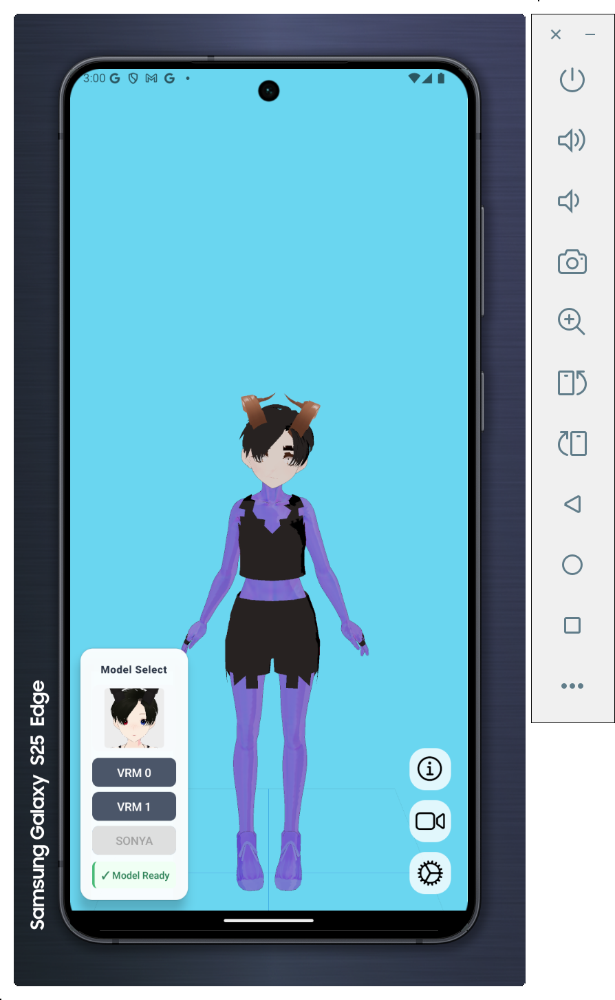
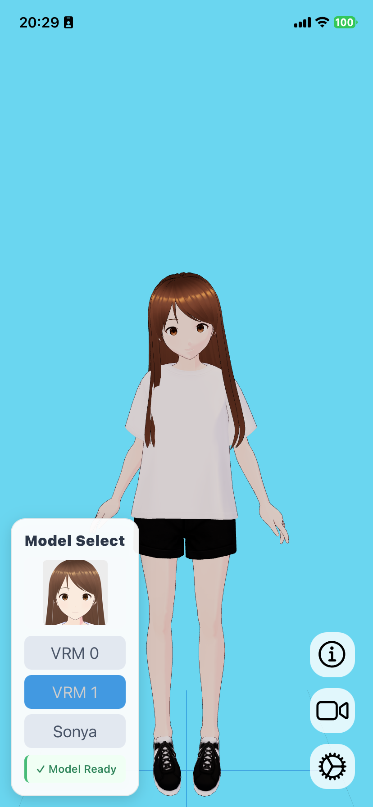
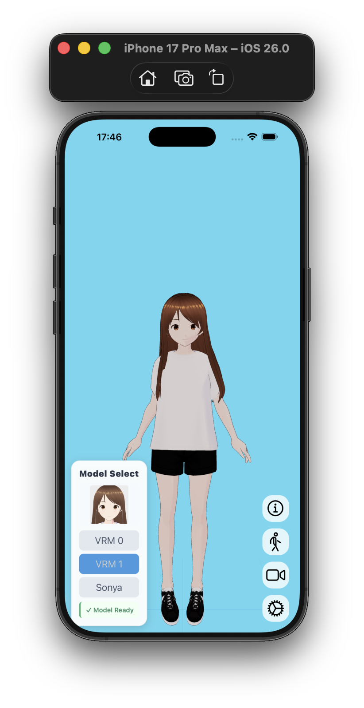
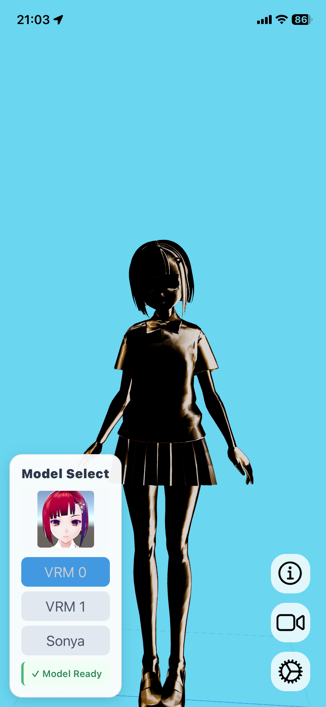
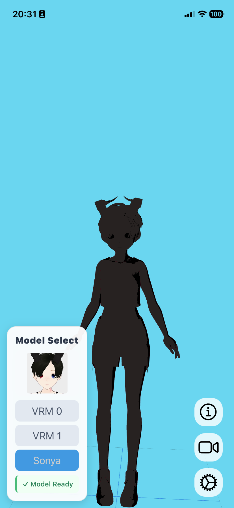
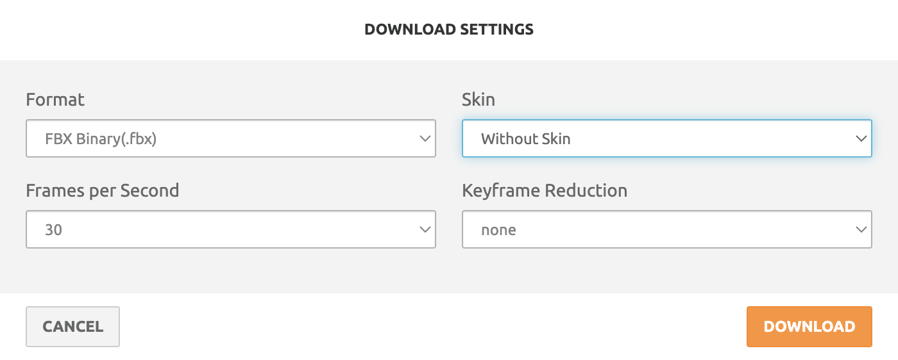

# VroidViewer
A React Native demo of [three-vrm](https://github.com/pixiv/three-vrm).

### Platforms
✅ Web  
➖ Android and iOS - See the below issues.

## Android
- You can see the result on an Android Emulator:
  

The model is rendered correctly for **VRM1_Constraint_Twist_Sample.vrm**

- As for any other models, we have issues with the textures.
    - vrm 0.x models:

      
    - vrm 1 models:

      

## iOS
- As for the iOS, it was tested on a development build directly on a physical device (iPhone 11) and an iOS Simulator (iPhone 17 Pro Max).:
  

The model is also rendered correctly for **VRM1_Constraint_Twist_Sample.vrm**

- Like with Android, we have issues with the textures on any other models.
    - vrm 0.x models:

      
    - vrm 1 models:

      

- For some reasons, the max texture size on iOS Simulator are "4096", and causes the model to display only after a while or not display at all

## Known Mobile Issues
- As you may have seen, The model **VRM1_Constraint_Twist_Sample** (named vrm1.vrm in this project) is the only model that renders correctly
- The other models are lacking texture
- GLTFLoader progress callback is ignored on mobile.

# To-Do
- Add [WebGPU example](https://github.com/wcandillon/react-native-webgpu)

## Dev Setup
1. Clone this repo
2. Run `bun i` in main directory
3. Run `bun run start` to start dev server

### Animations
If you want to test the extra animations in the demo:

1. Download the [motion pack](https://vroid.booth.pm/items/5512385).
2. Extract and place the VRMA files in the assets/animations/motion_pack folder.

### Mixamo Animations
If you want to test the more animations, you can:

1. Go to [Mixamo](https://www.mixamo.com/):
2. Choose an animation you like
3. Download it as FBX without skin, with 30 fps
   

This works with Expo Go 53, so building isn't required.

If you wanna test on Expo Go for iOS, you'll need to update the package and migrate to expo SDK 54